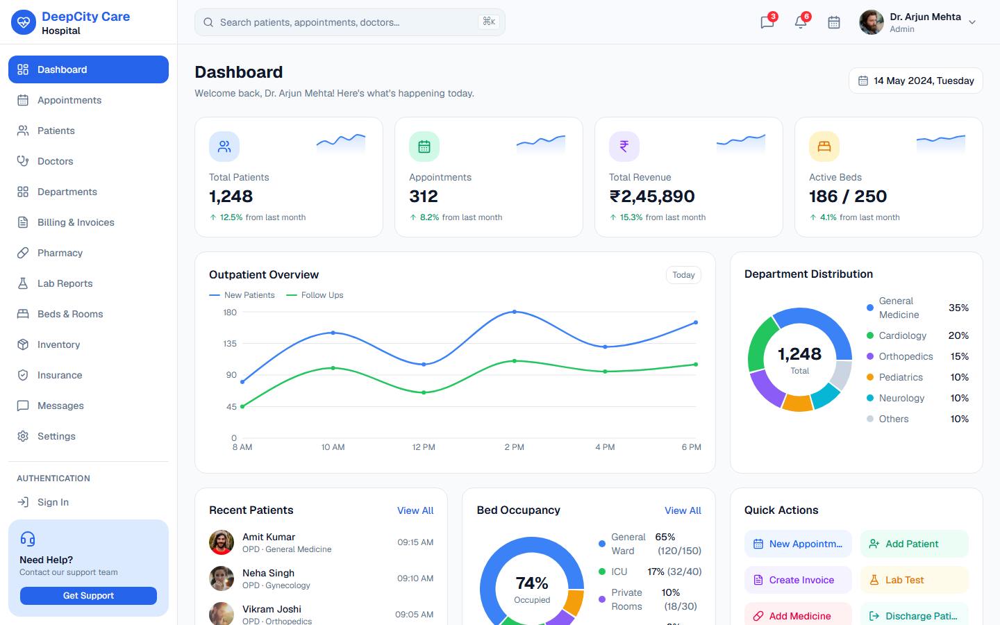

# DeepCity Care Hospital

A full hospital administration dashboard template — appointments, patients, doctors,
departments, billing, pharmacy, lab reports, beds & rooms, inventory, insurance, messaging
and a fully-tabbed settings area, built with **React 19 + Vite + TypeScript + shadcn/ui +
Tailwind CSS v4**.

**🔗 Live demo: [deepcity-care.codespanda.com](https://deepcity-care.codespanda.com/)**

[](https://react.dev/)
[](https://www.typescriptlang.org/)
[](https://vite.dev/)
[](https://tailwindcss.com/)
[](https://ui.shadcn.com/)
[](./LICENSE)



📚 Full docs: [`docs/`](./docs/README.md) · Live in-app docs: [deepcity-care.codespanda.com/docs](https://deepcity-care.codespanda.com/docs)

## Features

- **Dashboard** — patient/appointment/revenue/bed stat cards, outpatient trend chart,
  department distribution, recent patients, today's appointments, quick actions
- **Appointments** — list with filters, a day/week/month doctor schedule board, and a full
  appointment detail page (timeline, patient summary, billing)
- **Patients** — searchable list + a detailed patient profile (vitals, medications,
  diagnosis history, prescriptions, insurance, activity timeline)
- **Doctors, Departments** — directories with availability/performance charts
- **Billing & Invoices, Pharmacy, Lab Reports, Inventory** — each with its own stat cards,
  filterable table, and supporting charts (stock levels, revenue, test volume, ...)
- **Beds & Rooms** — live occupancy overview plus interactive Room Transfer and Bed
  Management dialogs
- **Insurance** — policies, claims and provider breakdowns
- **Messages** — a full chat UI (conversation list, thread, quick actions)
- **Settings** — 12 fully-built tabs (General, Profile, Password & Security, Notifications,
  Email/SMS, Billing, Hospital Info, Users & Roles, Integrations, Backup & Restore, System
  Logs), including a working **dark mode toggle**
- **Auth** — standalone Sign In / Sign Up pages outside the dashboard shell
- Consistent **"+ Add / Create / Upload"** popups everywhere, built from one generic,
  reusable form-dialog component

## Tech stack

| | |
| --- | --- |
| Framework | [React 19](https://react.dev/) + [React Router](https://reactrouter.com/) (`BrowserRouter`, with a GitHub Pages SPA-fallback) |
| Build tool | [Vite](https://vite.dev/) |
| Language | TypeScript |
| Styling | [Tailwind CSS v4](https://tailwindcss.com/) with light/dark design tokens |
| Components | [shadcn/ui](https://ui.shadcn.com/) (Radix primitives) |
| Charts | [Recharts](https://recharts.org/) |
| Icons | [Lucide](https://lucide.dev/) |
| Data | Static TypeScript fixtures — no backend, no API layer |

## Getting started

```bash
npm install
npm run dev
```

Full setup instructions, scripts and conventions: [`docs/getting-started.md`](./docs/getting-started.md).

## Documentation

| | |
| --- | --- |
| 📚 [`docs/`](./docs/README.md) | Getting started, project structure, component reference, theming, deployment, adding a page |
| 🧩 [`templates/`](./templates/README.md) | Copy-paste starter files for a new page, detail page, dialog or shared component |
| 🤝 [`CONTRIBUTING.md`](./CONTRIBUTING.md) | How to propose a change |

## Project structure

```
src/
├── components/
│   ├── ui/        shadcn/ui primitives
│   ├── shared/    App-wide building blocks (StatCard, DonutCard, EntityFormDialog, ...)
│   └── layout/    AppLayout, AppSidebar, Topbar, AuthLayout
├── data/          Static mock fixtures, one file per entity
├── lib/           nav.ts, formFields.ts, theme.tsx, utils.ts
└── pages/         One file per route
```

Full breakdown: [`docs/project-structure.md`](./docs/project-structure.md).

## Deployment

Deployed to GitHub Pages via `npm run deploy` (builds and pushes `dist/` to the `gh-pages`
branch, served at a custom domain). Details, plus the base-path gotchas to know about
before touching `vite.config.ts`: [`docs/deployment.md`](./docs/deployment.md).

## License

[MIT](./LICENSE) — do what you like with it.
